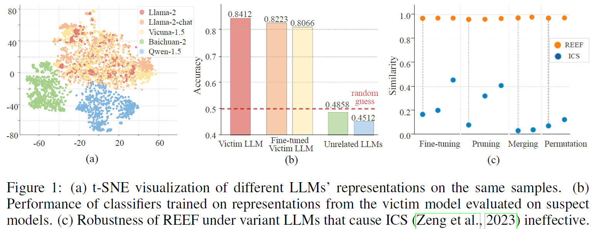

<!-- <p align="center">
  
</p> -->


## <div align="center">REEF: Representation Encoding Fingerprints for Large Language Models<div> 

<div align="center">
<a href="https://arxiv.org/abs/2410.14273"></a> &ensp;
</div>


## 🌈 Introduction
We are excited to present 'REEF: Representation Encoding Fingerprints for Large Language Models,' an efficient and robust approach designed to protect the intellectual property of open-source LLMs. 

> In this paper, we propose a training-free REEF to identify the relationship between the suspect and victim models from the perspective of LLMs' feature representations. Specifically, REEF computes and compares the centered kernel alignment similarity between the representations of a suspect model and a victim model on the same samples. This training-free REEF does not impair the model's general capabilities and is robust to sequential fine-tuning, pruning, model merging, and permutations.

In summary, REEF provides a simple and effective way for third parties and model owners to protect LLMs' intellectual property together.





## 🚀Getting Started

### 💻Prerequisites

```bash
git clone https://github.com/tmylla/REEF.git
cd REEF
pip install -r requirements.txt
```


### 🌟Usage

**Main Experiments**
```bash
cd src/

# generation activations
sh ./scripts/save_activation.sh
# compute the cka-similarity
python compute_cka.py --base_model llama-2-7b --base_layers -1 --base_model vicuna-7b-v1.5 --base_layers -1 
# plot the cka-heatmap
plot.ipynb
```

**Preliminary Experiments**

```bash
# train linear/MLP/CNN classifier
python train_cls.py --model llama-2-7b --layers 18 --datasets truthfulqa
# train GCN classifier
python train_cls_gcn.py --model llama-2-7b --layers 18 --datasets truthfulqa

# apply the classifier to suspect models
python transfer_cls.py --pretrain_dir classifier_path --suspect_model vicuna-7b-v1.5 --layers 18
```

**Replication of Comparative Experiments**

- *Human-Readable Fingerprint for Large Language Models*
```bash
python pcs.py
python ics.py
```

- *A Fingerprint for Large Language Models*
```bash
# generation logits activations
sh ./scripts/save_logits.sh

python logit.py
```


## 💪To-Do List
We are actively maintaining a repository focused on [Fingerprinting Large Language Models (LLMs)](https://github.com/tmylla/awesome-llm-fingerprint). If you find our project helpful or interesting, we would greatly appreciate your support by giving it a star ⭐.


## 📝License
Distributed under the Apache-2.0 License. See LICENSE for more information.

## 📖BibTeX
```
@misc{zhang2024reefrepresentationencodingfingerprints,
      title={REEF: Representation Encoding Fingerprints for Large Language Models}, 
      author={Jie Zhang and Dongrui Liu and Chen Qian and Linfeng Zhang and Yong Liu and Yu Qiao and Jing Shao},
      year={2024},
      eprint={2410.14273},
      archivePrefix={arXiv},
      primaryClass={cs.CL},
      url={https://arxiv.org/abs/2410.14273}, 
}
```